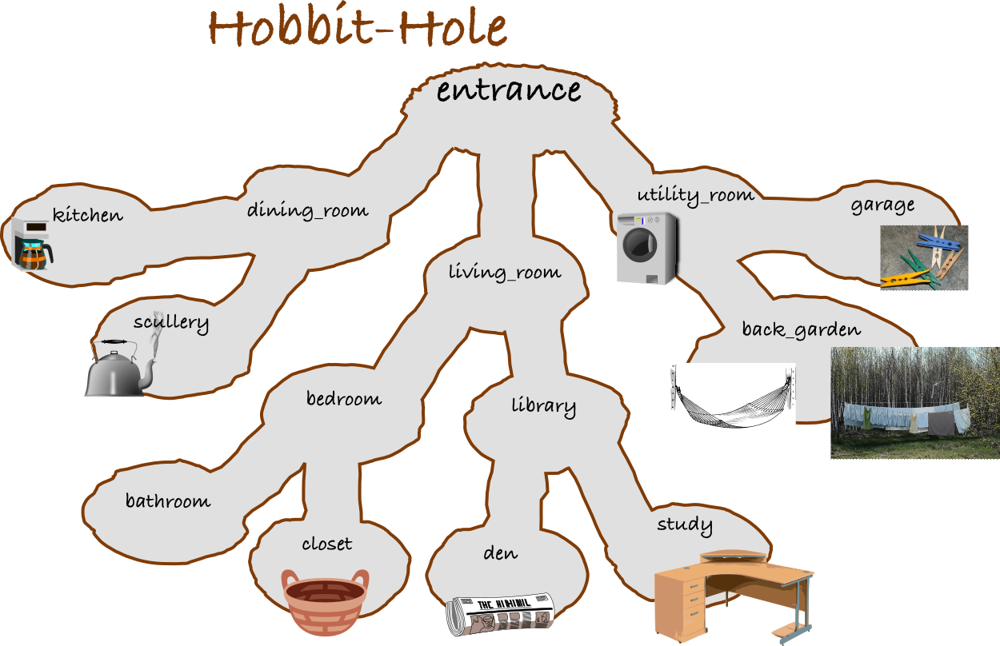

# You're a Hobbit!

You're a hobbit who has just had a long day walking around the shire, and now you come home to your Hobbit Hole.

Your Hobbit Hole is built in the classic Hobbit Hole style. You have many rooms, each one dug out a little deeper into the ground. Each room is connected by a passage way to just one room above it, but can have many rooms dug out below. Here's a map!



## Doing activities in your Hobbit Hole.

There are lots of activities to do in your Hobbit Hole. All you have to do is navigate to the room where the activity (shell scipt) exists. Remember that to do that, you use `cd`. To move into the `entrance`, we do

```bash
cd entrance/
```

Then, to move into the `living_room`, we have to do

```bash
cd living_room/
```

Once we're in the `library`, to get to the `kitchen`, we need to move back up into the `entrance`, then down into the `dining_room` and down once more into the `kitchen`, like so

```bash
cd ../dining_room/kitchen/
```

To look around for activities to do in the kitchen, we can use `ls`, which in this case tells us we can `make_coffee.sh`, which we can try to do with `source`.

```bash
source make_coffee.sh
```

## The Goal
After a long day of activities, all you really want to do is go `relax_in_hammock.sh` in your `back_garden`. So in `main.sh` you enter

```bash
cd entrance/utility_room/back_garden/
source relax_in_hammock.sh
```

Then you hit the big green Run button. The following should print in the console.

```
(You approach the hammock)
I can't relax until I've read my newspaper in the study!
```

## The process

Keep adding commands, either before or after previous commands, to get to a point where you can comfortably relax in the hammock!

### Notes

- Every time you press run, it's starting from fresh. If you, for example, made coffee the last time you hit Run, and then delete the code to make the coffee, your coffee won't still be there!
- Don't any other shell script except `main.sh`.
- You can leave comments to yourself with `#`. Any line, or part of a line that starts with `#` won't be interpreted.

```bash
# I'm going to go to the kitchen
cd entrance/dining_room/kitchen/
```